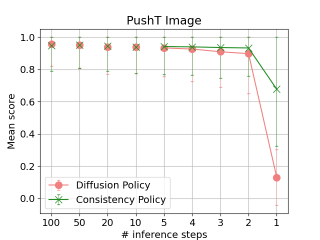
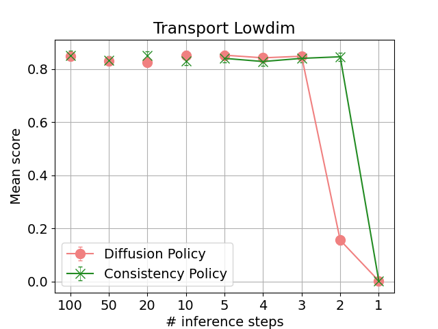

# Consistency Policy

<em>TLDR Consistency Policy achieves high accuracy with  2-step inference in cases where Diffusion Policy fails.  Nevertheless, Diffusion Policy with a DDIM solver does   well enough in many other cases.</em>

&nbsp;

[Diffusion Policy](https://arxiv.org/abs/2303.04137) makes use of diffusion models to generate action trajectories for robots. This involves sampling pure noise and progressively "denoising" it into a feasible trajectory via multiple forward passes through a neural network. Depending on the latency requirements of the application, and the size/complexity of the neural network, the number of forward passes can become a latency bottleneck. One can get away with less forward passes, but at some point this becomes a trade-off between speed and accuracy.

In this project, I tried distilling the denoising neural networks from the [Diffusion Policy](https://arxiv.org/abs/2303.04137) work into [consistency models](https://arxiv.org/abs/2303.01469) in order to answer the question. **Can we get a more favorable trade-off between speed and accuracy?** Spoiler alert: we can, but on many of the simulated environments in [Diffusion Policy](https://arxiv.org/abs/2303.04137), algorithms like [DDIM](https://arxiv.org/abs/2010.02502) (a training-free method for few step inference with a pretrained diffusion model) already work very well.

A note on this repository: this is a fork of the [original Diffusion Policy work](https://github.com/real-stanford/diffusion_policy). I've made full use of their boiler-plate and I've made as little changes as possible to their code. 99% of my work is in the `consistency_policy` folder (and even there, the starter code is from the original work). If you want to try running this code, you may want to check out [consistency_policy/SETUP_AND_USAGE.md](.consistency_policy/SETUP_AND_USAGE.md).

## Results and discussion

These plots (_see [Methods](#methods) for more details on how they were made_) show the success metric vs the number of forward passes through the policy's neural network for Diffusion Policy and Consistency Policy. Note that the neural networks have identical topologies and only differ in their weights, so this really is comparing apples for apples in terms of inference time. Each point is the result of averaging 500 experiments, each with a differently seeded environment initialization.

*Notes on these plots*:

- *"Lowdim" means that the consistency model is conditioned on knowledge of the state of the environment (eg; positions of manipulands or obstacles). "Image" means that the consistency model is conditioned on camera views of the environment. In both cases, measurements of the robot state are incorporated in the conditioning.*
- *"Lowdim PushT" makes use of observations by inpainting for guidance in between denoising steps, whereas "Lowdim Transport" uses the observations as conditioning for the neural network. (this is in line with the work done in [Diffusion Policy](https://arxiv.org/abs/2303.04137) but perhaps worth an explicit mention).*
- *Unlike [Diffusion Policy](https://arxiv.org/abs/2303.04137)'s experiments, I don't use 3 training seeds due to resource/time constraints. Nevertheless, I found that the variability within a training seed is as much as the variability between training seeds when evaluating the original [Diffusion Policy](https://arxiv.org/abs/2303.04137) models.*
- *For evaluating the [Diffusion Policy](https://arxiv.org/abs/2303.04137) work, I use the [DDIM](https://arxiv.org/abs/2010.02502) algorithm for inference. I use the neural network weights that were used as the teacher for the the consistency model featured on the same plot.*
- *The bottom axis shows number of inference steps. For any given number of inference steps I use a linear step schedule. Here's an example. Suppose I want to do inference in 3 steps. The model was trained with 100 noise levels. I set my step size to `ceil(100 / 3) = 34`. Then the steps look like `100 -> 66 -> 32 -> 0`.*
- *PushT experiments have a variable score in [0, 1]. Therefore I used a straight mean for the points, and a single standard deviation for the error bars (probably an overestimation on the error because they don't account for the restricted domain). For any other experiments the score is discrete in {0, 1}. Therefore I use a beta distribution with a uniform prior and plot the expectation value for the point and use a 68.1% confidence interval for the error bars.*
- ***Edit: 2024/02/03**: I redid the plots as I realized I may have generated them with training seeds for the environment initializations. The changes were minor and had no bearing on the rest of the discussion.*

I admit I got rather excited when I saw the "PushT Lowdim" plot, but then disappointed seeing the rest. I also tried "Transport Image" and "Toolhang Image" but quickly realized that DDIM works very well for those all the way out to 2-step inference (I didn't carry on with these as they are computationaly much heavier for training and evalutation).

Just for fun, the GIF at the top of this README shows rollouts for the extreme case in which we only apply 2 forward passes of each network, for the "Lowdim" variants (no surprises here given the plots above, animations are just prettier).

### Why does DDIM do so well? (my speculations)

Recall that the key difference between "PushT Lowdim" (which provided the biggest gap between Consistency Policy and Diffusion Policy) and the other experiments is that it incorporates the observations as inpainting rather than as neural network conditioning inputs.

In general, I suspect [DDIM](https://arxiv.org/abs/2010.02502) does well in these settings because the target probability distribution over trajectories often becomes uni-modal and very narrow when conditioning is incorporated. Recall that in the experiments where we provide conditioning to the denoising network, we are modelling `P(x(0) | x(T), c)`  where `x(0)` represents a clean trajectory, `x(T)` is a pure gaussian noise and `c` is the observation as conditioning. In tasks like caption-conditioned image generation, this distribution is still (very, very) highly multi-modal. But in tasks like the experiments in [Diffusion Policy](https://arxiv.org/abs/2303.04137), once a condition is provided, there are only 1 or a few ways the trajectory ought to go. Consider for example "Transport" at the point where one of the robot arms has the hammer. There's only one clear path forward: move the arms together. 

DDPM's are trained on the MSE between the neural network's output and the ground truth. In the scenario depicted above, even given a fully noised trajectory `x(T)`, the only reasonable things for the DDPM training procedure to learn is to directly predict the mean of all the training data in such a scenario: ie the arms moving together. I don't think this argument only works for the uni-modal case. Adding extra modes likely just means an extra DDIM step is needed to break the ambiguity. That's about as far as I'm willing to reach with my speculations for the time being... hopefully I'll get the chance to put these ideas to the test.

## Methods

The code is the best source of truth for what I did but I can give an overview of the key points here.

### Inference

For inference, I follow Algorithm 1 of [CM](https://arxiv.org/abs/2303.01469). The only differences are:

- I pass the conditioning (where applicable) to the neural network as well.
- Algorithm 4 shows how to incorporate inpainting, but there they do `denoise -> inpaint -> renoise` whereas **I do `inpaint -> denoise -> renoise`. This variant is crucial** to good results (I spent a long time wondering why it looked like my agent was not respecting the initial observations). In fact, "my" variant is more in line with what one would do with [DDPM](https://arxiv.org/abs/2006.11239) or [DDIM](https://arxiv.org/abs/2010.02502), and I somewhat suspect there's an error in Algorithm 4.
- Also of note, but not in Algorithm 2, is that I don't do any clipping between steps. Clipping to the data range is a common feature of diffusion model libraries but it just bothers me because it means you are presenting the denoiser network with inputs unlike those seen during training. Moreover, it's only on the final output that clipping should matter. Anyway, I found it didn't make a difference, so I stuck with my way.

### Training

For training I follow Algorithm 2 of [CM](https://arxiv.org/abs/2303.01469) with some tweaks:

- I found that **reweighting the loss according to the timesteps sampled was crucial** for getting a good result. They also suggest this in [iCM](https://arxiv.org/abs/2310.14189). I started by mathematically motivating my weighting as a means of decoupling the loss as much as possible from the specifics of the schedule. Then, motivated by the weighting used in [iCM](https://arxiv.org/abs/2310.14189), I took the square root of mine. I can no longer mathematically justify it, but hey, it does better. Why not just use the one from [iCM](https://arxiv.org/abs/2310.14189)? Because they consider a variance-exploding diffusion process, whereas in Diffusion Policy they use the [DDPM](https://arxiv.org/abs/2006.11239), variance-preserving variant.
- I doubled down on the point above and used **importance sampling** on top of the baseline reweighting. I'm pretty sure this helped. Basically, keep track of the EMA of the losses per timestep and use that to weigh the sampling probability for those timesteps (higher loss means give more weight), while down-weighing the respective loss terms to counter balance the overall contribution to the loss.
- **I use the skipping-steps technique** from [LCM](https://arxiv.org/abs/2310.04378). But with a small tweak of my own: I allow skipping between `n = 0` and `n = j` for all `0 < j < k` where k is the skipping-steps parameter. I just felt uneasy not training the neural network to be able to be conditioned on `n = j < k`. I never got conclusive results on whether this made a difference.
- As per the advice in [iCM](https://arxiv.org/abs/2310.14189) **I don't use the EMA model for the target model** in the distillation loss. Although I still do keep track of an EMA model which ends up being used for evaluation.

For the teacher network, for each task I picked the highest scoring model from the [Diffusion Policy](https://arxiv.org/abs/2303.04137) work, except for PushT tasks for which I used the original training configs to train diffusion policy with more data (they weren't making use of all the available training data). The consistency model network was initialized with the teacher network weights. For the ODE solver I used [DDIM](https://arxiv.org/abs/2010.02502) with a single Euler step.

## Noteworthy things I didn't have time to try

- More environments. On my machine, "Toolhang Image" took around 5 minutes to train per epoch and 22 minutes to evaluate just 50 rollouts. 
- Vanilla consistency training (there's support in the code to try this but I didn't take the time to get it working well).
- Using a Heun solver with DDIM during training. Or using alternatives to DDIM like like [DPM](https://arxiv.org/abs/2206.00927).
- Transformer based policies. I felt confident enough they would yield similar conclusions.
- Ternary search for better denoising schedules at inference time (I just used a linear schedule).

## References / Acknowledgements

Papers:

- [Diffusion Policy: Visuomotor Policy Learning via Action Diffusion](https://arxiv.org/abs/2303.04137)
- [Consistency Models](https://arxiv.org/abs/2303.01469)
- [Latent Consistency Models: Synthesizing High-Resolution Images with Few-Step Inference](https://arxiv.org/abs/2310.04378)
- [Elucidating the Design Space of Diffusion-Based Generative Models](https://arxiv.org/abs/2206.00364)
- [Improved Techniques for Training Consistency Models](https://arxiv.org/abs/2310.14189)
- [Denoising Diffusion Implicit Models](https://arxiv.org/abs/2010.02502)
- [Denoising Diffusion Probabilistic Models](https://arxiv.org/abs/2006.11239)

Many thanks to the authors of the [Diffusion Policy Github](https://github.com/real-stanford/diffusion_policy) (from which this work is forked) for their excellent work.
